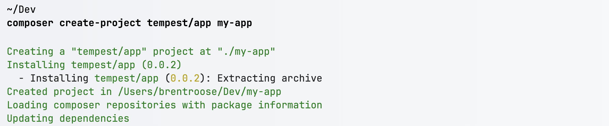
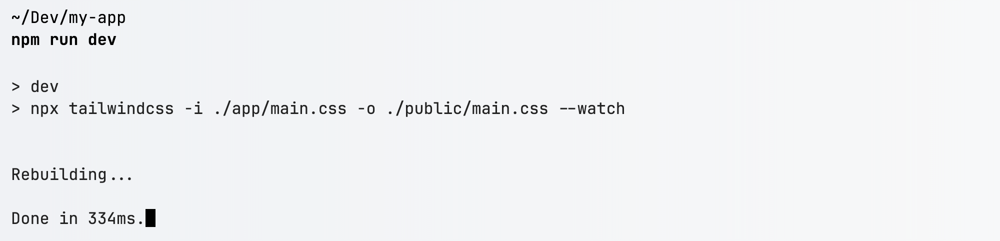
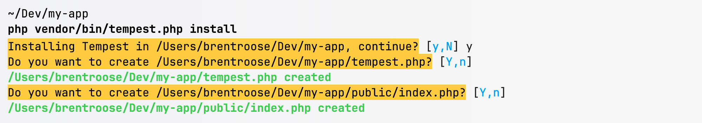

Tempest is a PHP MVC micro-framework that gets out of your way. Its design philosophy is that developers should write as little framework-related code as possible, so that they can focus on application code instead.

## Getting started

You can install Tempest in two ways: as a web app with a basic frontend bootstrap, or by requiring the framework as a package in any project you'd like.

### Tempest as a project

If you want to start a new Tempest project, you can use `tempest/app` as the starting point. Use `composer create-project` to start:

```
composer create-project tempest/app my-app
cd my-app
```



This project scaffold includes a basic frontend setup including tailwind:

```
npm run dev
```



### Tempest as a package

If you don't need an app scaffold, you can opt to install `tempest/framework` as a standalone package. You could do this in any project; it could already contain code, or it could be an empty project.

```
composer require tempest/framework
```

Installing Tempest this way will give you access to the tempest console as a composer binary:

```
php vendor/bin/tempest.php
```

Optionally, you can choose to install Tempest's entry points in your project:

```
php vendor/bin/tempest.php install
```

Installing Tempest into a project means that it will copy one or two files into that project:

- `public/index.php` — the web application entry point
- `tempest.php` – the console application entry point

You can choose which files you want to install, and you can always rerun the `install` command at a later point in time:



## A basic Tempest project

Tempest won't impose any fixed file structure on you: one of the core principles of Tempest is that it will scan you project code for you, and it will automatically discover any files it needs to. For example: Tempest is able to differentiate between a controller method and a console command by looking at the code, instead of relying on naming conventions. This is what's called **discovery**, and it's one of Tempest's most powerful features. 

You can make a project that looks like this:

```
app
├── Console
│   └── RssSyncCommand.php
├── Controllers
│   ├── BlogPostController.php
│   └── HomeController.php
└── Views
    ├── blog.view.php
    └── home.view.php
```

Or a project that looks like this:

```
app
├── Blog
│   ├── BlogPostController.php
│   ├── RssSyncCommand.php
│   └── blog.view.php
└── Home
    ├── HomeController.php
    └── home.view.php
```

For Tempest, it's all the same.

Discovery works by scanning you project code, and looking at each file and method individually to determine what that code does. For production apps, Tempest will cache these results as PHP code, so there's absolutely no performance overhead to doing so.

As an example, Tempest is able to determine which methods are controller methods based on their route attributes:

```php
final readonly class BlogPostController
{
    #[Get('/blog')]
    public function index() 
    { /* … */ }
    
    #[Get('/blog/{post}')]
    public function show(Post $post) 
    { /* … */ }
}
```

And likewise, it's able to detect console commands based on their console command attribute:

```php
final readonly class RssSyncCommand
{
    public function __construct(private Console $console) {}

    #[ConsoleCommand('rss:sync')]
    public function __invoke(bool $force = false)  
    { /* … */ }
}
```

We'll cover controllers and console commands in depth in future chapters.